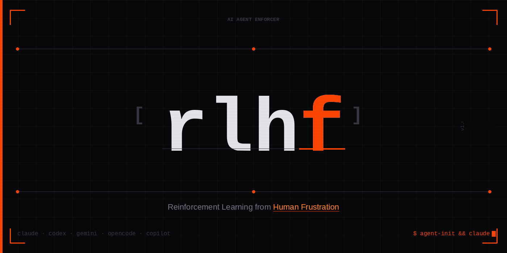

# rlhf

> Reinforcement Learning from Human Frustration



AI coding agents drift. They forget instructions, stop committing, and ignore your task list. `rlhf` enforces discipline from **outside** the model — a filesystem daemon watches every file change, checks rules, and when violated: reverts the file, freezes the agent with SIGSTOP, and demands acknowledgment before resuming.

---

## How It Works

```
You → rlhf-run → agent (claude / codex / gemini / opencode / copilot)
         │
         ├── [1] Context injection: session state + git history → instruction file
         ├── [2] Watchdog: auto-commits every N min (agent-independent)
         ├── [3] Daemon: watches every file change → checks rules → blocks violations
         └── [4] Monitor: shows block message, freezes agent, waits for you
```

### On a rule violation:

```
File changed
    ↓
Rule engine checks: session fresh? right branch? task set? TODO followed?
    ↓  FAIL
git restore <file>          ← edit cancelled immediately
SIGSTOP agent               ← agent frozen
╔══════════════════════════════════════╗
║  ⛔  RLHF BLOCKED — AGENT SUSPENDED ║
║  Rule:   session_stale               ║
║  File:   src/auth.js                 ║
║  Reason: session not updated 20+ min ║
║  [Enter] Resume    [q] Quit          ║
╚══════════════════════════════════════╝
    ↓  user presses Enter
SIGCONT agent               ← agent resumes
```

---

## Rules

Configured per-project in `.rlhf-rules`. All rules are active by default.

| Rule | Trigger | Action |
|---|---|---|
| `session_missing` | `.agent-session.md` doesn't exist | Block |
| `task_not_set` | `Current Task` field is empty | Block |
| `session_stale` | Session file not updated in >15 min | Block |
| `wrong_branch` | Git branch ≠ `Branch:` in session file | Block |
| `protected_branch` | Editing directly on main/master | Block |
| `todo_mismatch` | Task not found in `TODO.md` | Warn only |

---

## Supported Agents

| Agent | Command | Instruction File | Confirmed |
|---|---|---|---|
| Claude Code | `claude` | `CLAUDE.md` | ✅ |
| OpenAI Codex CLI | `codex` | `AGENTS.md` | ✅ |
| Gemini CLI | `gemini` | `GEMINI.md` | ⚠️ Needs verification |
| OpenCode | `opencode` | `OPENCODE.md` | ⚠️ Needs verification |
| GitHub Copilot CLI | `copilot` | `.github/copilot-instructions.md` | ⚠️ CLI support unconfirmed |

> If an agent doesn't read its instruction file, the daemon still enforces git discipline and the block/freeze mechanism still works — only context injection is ineffective for that agent.

---

## Platform Support

| Platform | Setup | File Watcher |
|---|---|---|
| Linux | `setup.sh` | `inotifywait` (fastest) → polling fallback |
| macOS | `setup.sh` | `fswatch` → polling fallback |
| Windows (PowerShell) | `setup.ps1` | `FileSystemWatcher` (.NET, native) |
| Windows (WSL) | `setup.sh` | Same as Linux |

**Linux install for inotifywait:**
```bash
sudo apt install inotify-tools   # Debian/Ubuntu
sudo yum install inotify-tools   # RHEL/CentOS
```

**macOS install for fswatch:**
```bash
brew install fswatch
```

Without these tools, rlhf falls back to 2-second polling. Rules still enforce — just slightly less responsive.

---

## Install

### Linux / macOS

```bash
git clone https://github.com/yourname/rlhf.git ~/rlhf
cd ~/rlhf
chmod +x setup.sh && ./setup.sh
source ~/.zshrc
```

### Windows (PowerShell)

```powershell
git clone https://github.com/yourname/rlhf.git $HOME\rlhf
cd $HOME\rlhf
.\setup.ps1
. $PROFILE
```

---

## Usage

### Start of every task:

```bash
cd your-project
rlhf-init
```

Prompts for task, branch, mode. Writes `.agent-session.md`. Makes initial commit.

### Run agent:

```bash
claude      # wrapped + enforced
codex       # wrapped + enforced
gemini      # wrapped + enforced
```

### Check state:

```bash
rlhf-status
```

---

## Session File

`.agent-session.md` is the source of truth. Daemon checks it on every file change.

```markdown
# Agent Session State

**Current Task:** Refactor auth module to JWT
**Branch:** feature/jwt-auth
**Last Completed Step:** Replaced session middleware
**Next Step:** Update tests
**Blockers:** None
**Files Modified:** src/middleware/auth.js
```

Rules check this file. If it's stale or incomplete — agent gets blocked.

---

## Configuration

`.rlhf-rules` in your project root:

```bash
SESSION_MAX_AGE_MIN=15      # block if session not updated in X minutes
ENFORCE_BRANCH=yes          # block if on wrong branch
BLOCK_MAIN_BRANCH=yes       # block edits directly on main/master
CHECK_TODO=yes              # warn if task not in TODO.md
REVERT_ON_VIOLATION=yes     # revert the file on block
BLOCK_COOLDOWN_SEC=30       # seconds between blocks (prevents spam)
WATCHDOG_INTERVAL=300       # auto-commit every N seconds
```

---

## File Structure

```
rlhf/
├── setup.sh                    # Linux/macOS install
├── setup.ps1                   # Windows install
├── .rlhf-rules                 # default rules config (copy to your project)
├── rlhf-logo.png
├── README.md
├── scripts/
│   ├── rlhf-run.sh             # main wrapper (Linux/macOS)
│   ├── rlhf-run.ps1            # main wrapper (Windows)
│   ├── rlhf-daemon.sh          # filesystem watcher + rule engine (Linux/macOS)
│   ├── rlhf-daemon.ps1         # filesystem watcher + rule engine (Windows)
│   ├── rlhf-init.sh            # session init (Linux/macOS)
│   ├── rlhf-init.ps1           # session init (Windows)
│   ├── rlhf-status.sh          # status view (Linux/macOS)
│   └── rlhf-status.ps1         # status view (Windows)
└── hooks/
    └── pre-commit              # git hook — blocks commits missing session update
```

---

## Runtime Files (project root)

| File | Purpose |
|---|---|
| `.agent-session.md` | Session state — source of truth |
| `.rlhf-rules` | Per-project rule config |
| `.rlhf-blocked` | IPC: daemon → monitor (deleted after each block) |
| `.rlhf-violations.log` | Full history of every violation |
| `.agent-watchdog.log` | Watchdog commit history |

Add to `.gitignore`:
```
.rlhf-blocked
.rlhf-lastblock
.rlhf-lastcheck
.agent-watchdog.log
```

---

## Escape Hatches

```bash
claude-raw          # run claude with zero enforcement
git commit --no-verify   # skip pre-commit hook (watchdog uses this)
```

---

## FAQ

**Q: Agent gets frozen and won't resume?**
Press Enter in the terminal where rlhf-run is running. If that doesn't work: `kill -CONT <agent-pid>` or just Ctrl+C to abort.

**Q: Too many false blocks?**
Increase `SESSION_MAX_AGE_MIN` or `BLOCK_COOLDOWN_SEC` in `.rlhf-rules`.

**Q: I'm on a protected branch legitimately?**
Set `BLOCK_MAIN_BRANCH=no` in `.rlhf-rules`.

**Q: Does this work with tmux / multiple terminal panes?**
Yes. The block message appears in the terminal where you ran `claude`/`codex`/etc.

---

## Why Not Just Use Instruction Files?

Instruction files get diluted as the context window fills. The model drifts. rlhf doesn't ask the model to behave — it enforces behavior at the OS level. The watchdog commits regardless of what the agent is doing. The daemon reverts files regardless of what the agent thinks it's doing. The hook blocks commits regardless.

The name is the reason you built this.

---

## Contributing

PRs welcome.
- Additional agents
- macOS `fswatch` testing
- Windows edge cases

---

## License

MIT
